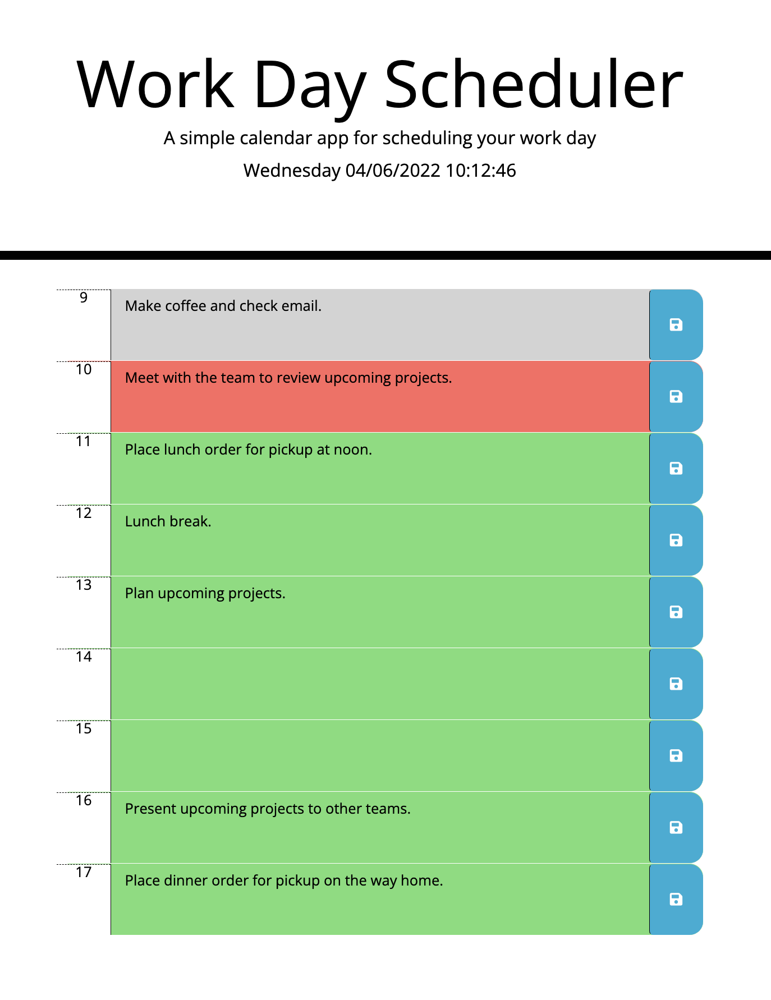

# 05-day-planner

Link to deployed application: https://aalink.github.io/05-day-planner/

This project's goal is to create a calendar application that allows a user to save events for each hour of the day. It makes use of jQuery in addition to [Moment.js](https://momentjs.com/) to work with dates and time.

  

```
Challenges
```
Although the popularity of jQuery and Moment.js has reduced over the years, it's still important for web developers to familiarize themselves with the features and benefits of each API.  This is because there are companies that still make use of them in their code. The challenge I experienced with this project was relatively simple, that is to say, it's a matter of becoming accustomed to the realization that jQuery is providing a different way of doing some of the same things can JavaScript can already do.  For example, to query or create an element, a web developer needs to make use of documentation to find the required code that provides the same functionality as traditional JavaScript.  Moment.js also provided the same challenge of having to make use of documentation.


```
What I Learned
```
Memorizing every single feature of an API is unrealistic, so this project was in large part an exercise of learning how to find the answer using the resources that are made available to developers as they are building their application.


```
Conclusion
```